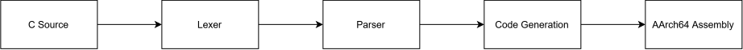

# ARM C Compiler
[](https://en.wikipedia.org/wiki/C_(programming_language))
[](https://www.linux.org/)
[](https://developer.arm.com/Architectures/AArch64)

A lightweight, zero-dependency C compiler written from scratch. It compiles C source code into AArch64 assembly. Then it can be assembled using GAS or [ARM Assembler](https://github.com/BJL156/ARM-Assembler).

This C compiler follows the next stage of my AArch64 toolchain by continuing from my last project: [ARM Assembler](https://github.com/BJL156/ARM-Assembler) by allowing C source code to be translated into assembly for use with my assembler to generate ELF64 executables.

## Overview
<p align="center">
  
</p>

## Build
> [!NOTE]
> **Needs to be built on Linux. For Windows, use WSL.**

Clone the repository and change into its directory:
```bash
git clone https://github.com/BJL156/ARM-C-Compiler
cd ARM-C-Compiler
```
Then use CMake:
```bash
cmake -B build
cmake --build build
```
The final executable will be written to: `build/compiler`.

## Usage
```bash
./compiler <file.c> <output>
  <file.c>  C source file.
  <output>  Output AArch64 file.
```

## Example
### Input ([examples/factorial.c](https://github.com/BJL156/ARM-C-Compiler/blob/main/examples/factorial.c))
```C
int factorial(int n) {
  int result = 1;

  while (n > 1) {
    result = result * n;
    n = n - 1;
  }

  return result;
}

int main() {
  return factorial(5);
}
```
### Build and Run
```bash
$ ./build/compiler ./examples/factorial.c ./examples/generated/factorial.s
$ ./build/assembler ./examples/generated/factorial.s ./build/factorial.out
$ ./build/factorial.out
$ echo $?
120
```
> [!TIP]
> **Generated assembly:** [examples/generated/factorial.s](https://github.com/BJL156/ARM-C-Compiler/blob/main/examples/generated/factorial.s)

## Features
- Lexer.
  - [x] Converts C source into tokens.
  - [x] Handles whitespace.
  - [x] Scans:
    - [x] End of file (`EOF`).
    - [x] Keywords (`int`, `char`, `void`, `if`, `else`, `while`, `for`, `return`).
    - [x] Identifiers and literals.
    - [x] Arithmetic and comparison operations.
- Parser.
  - [x] Converts tokens into an AST of statements and expressions.
  - [x] Variable declarations (`int`, `char`, pointers).
  - [x] Control flow (`if`, `else`, `while`, `for`).
  - [x] Expressions (binary, unary, assignment, function calls).
  - [x] Pointers.
- Code Generator.
  - [x] Outputs AArch64 assembly of AST.
  - [x] Handles function prologue and epilogue.

## Current Limitations
- no IR support.
- Single-file C programs only.
- no C standard library support.
- No code generation optimizations.
