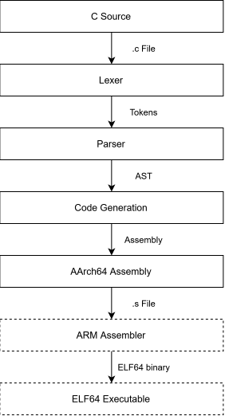

# ARM C Compiler
[](https://en.wikipedia.org/wiki/C_(programming_language))
[](https://www.linux.org/)
[](https://developer.arm.com/Architectures/AArch64)

A lightweight, zero-dependency C compiler written from scratch. It compiles C source code into AArch64 assembly which can then it can be assembled using GAS or [ARM Assembler](https://github.com/BJL156/ARM-Assembler).

This C compiler is the next stage of my AArch64 toolchain, continuing from my previous project: [ARM Assembler](https://github.com/BJL156/ARM-Assembler). By using both together, they create a toolchain that goes from C source code all the way down to an ELF64 executable.

## Architecture
<p align="center">
  
</p>

### Lexer
Reads C source code and converts it to a sequence of tokens. It handles whitespace, keywords, identifiers, literals, and operators.

### Parser
Builds an abstract syntax tree (AST) that represents the structure of the program. It handles declarations, statements, expressions, control flow, and pointers.

### Code Generation
Traverses the AST and produces AArch64 assembly. It handles function prologue/epilogue, variables, operators, and the program's entry point.

## Supported C
The compiler currently supports a subset of C, including:
- `int`, `char`, and `void` types.
- Variables and variable declarations.
- Functions and function calls.
- `if`/`else` statements.
- `while` and `for` loops.
- `return` statements.
- Arithmetic and comparison operations.
- Unary expressions.
- Assignment expressions.
- Pointers.

## Build
> [!NOTE]
> **Needs to be built on Linux. For Windows, use WSL.**

Clone the repository and change into its directory:
```bash
git clone https://github.com/BJL156/ARM-C-Compiler
cd ./ARM-C-Compiler
```
Then use CMake:
```bash
cmake -B build
cmake --build build
```
The final executable will be written to: `./build/compiler`.

## Usage
```bash
./compiler <file.c> <output>
  <file.c>  C source file.
  <output>  Output AArch64 file.
```

## Example
### Input ([./examples/factorial.c](https://github.com/BJL156/ARM-C-Compiler/blob/main/examples/factorial.c))
```C
int factorial(int n) {
  int result = 1;

  while (n > 1) {
    result = result * n;
    n = n - 1;
  }

  return result;
}

int main() {
  return factorial(5);
}
```
### Build and Run
```bash
# ARM C Compiler:
$ ./build/compiler ./examples/factorial.c ./examples/generated/factorial.s

# ARM Assembler:
$ ./build/assembler ./examples/generated/factorial.s ./build/factorial.out

# Run:
$ ./build/factorial.out
$ echo $?
120
```
> [!TIP]
> **Generated assembly:** [./examples/generated/factorial.s](https://github.com/BJL156/ARM-C-Compiler/blob/main/examples/generated/factorial.s)

## Current Limitations
- No IR support.
- Single-file C programs only.
- No C standard library support.
- No code generation optimizations.
